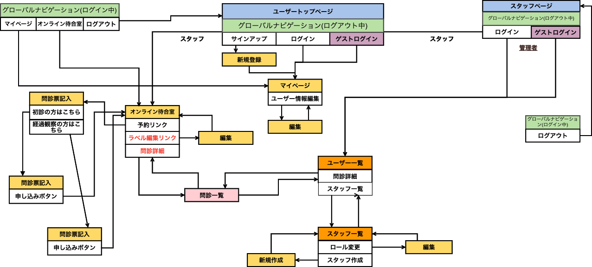

# README

## 開発言語
- Ruby version '2.6.5'
- rails version '6.0.5'

## 実行手順
```
$ git clone
$ cd rails_app
$ bundle
$ rails db:create db:migrate
$ rails db:seed
$ rails s

$ cd nuxt_app
$ yarn install
$ yarn dev
```

## カタログ設計
https://docs.google.com/spreadsheets/d/1yrvNVz2DJwZVSdH5rgZQOb-NjcIYiwF3FosHNRnCfcg/edit?usp=sharing

## テーブル定義書
https://docs.google.com/spreadsheets/d/1yrvNVz2DJwZVSdH5rgZQOb-NjcIYiwF3FosHNRnCfcg/edit?usp=sharing

## ワイヤーフレーム
https://docs.google.com/spreadsheets/d/1yrvNVz2DJwZVSdH5rgZQOb-NjcIYiwF3FosHNRnCfcg/edit?usp=sharing

## ER図


## 画面遷移図
