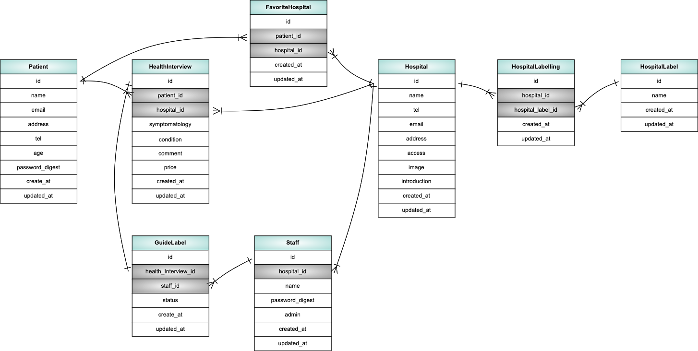
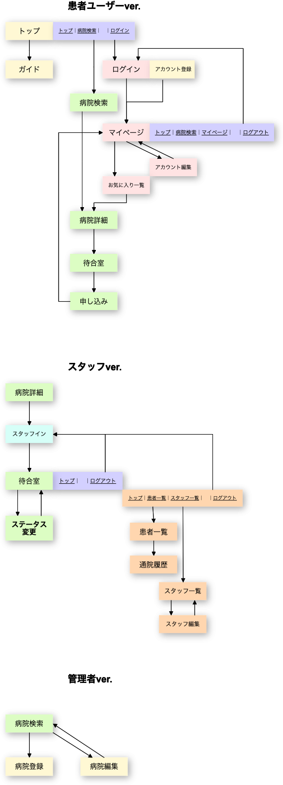

# README
## 現在デプロイ中のコードはaws_ver branchのものになります。

## 開発言語
- Ruby version '2.6.5'
- rails version '6.0.5'

## 実行手順
```
$ git clone
$ cd rails_app
$ bundle
$ rails db:create db:migrate
$ rails db:seed
$ rails s

$ cd nuxt_app
$ yarn install
$ yarn dev
```

## カタログ設計/テーブル定義書/ワイヤーフレーム
https://docs.google.com/spreadsheets/d/1WWDc_jzAH1NAefa9Tkv03tdus7J6q9wp8pRohpaYddE/edit?usp=sharing

## ER図


## 画面遷移図

